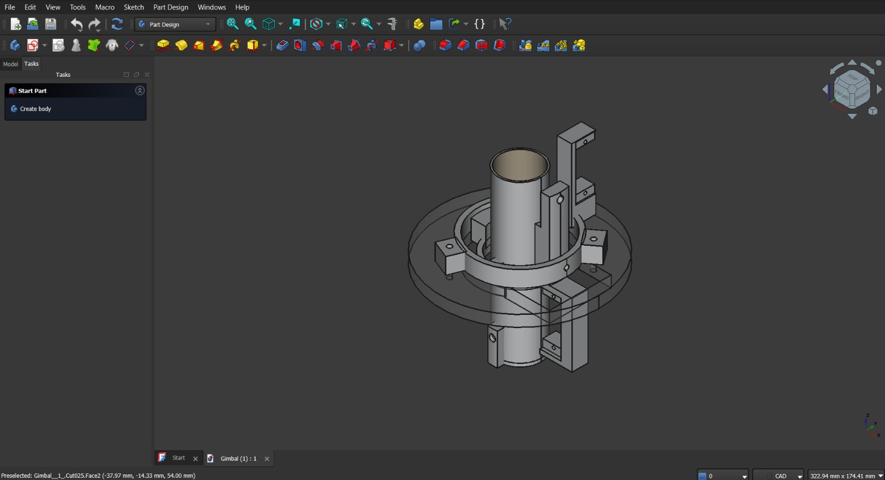

# 2-Axis Gimbal for Rocket Thrust Control

## Description

This folder contains design material related to the two-axis gimbal mechanism for rocket thrust control. The included CAD screenshot shows the modeled gimbal assembly used for design and prototyping reference.

## Folder Caption

> Designing and prototyping a two-axis gimbal for rocket thrust control.

## Contents

- Photos/images: **1**
- Videos: **0**

## Image Files

- `gimbal_thrust_control_cad_01.jpeg`

## Preview

