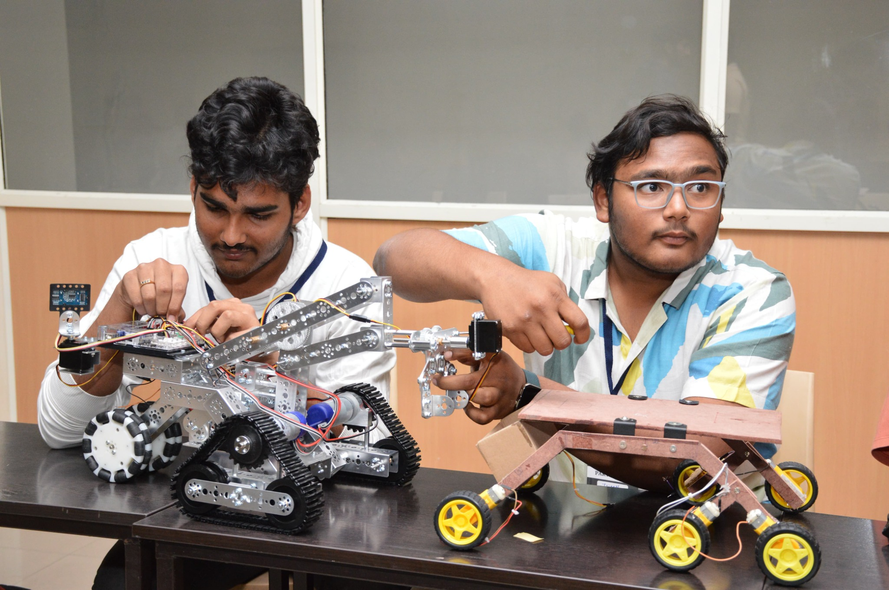
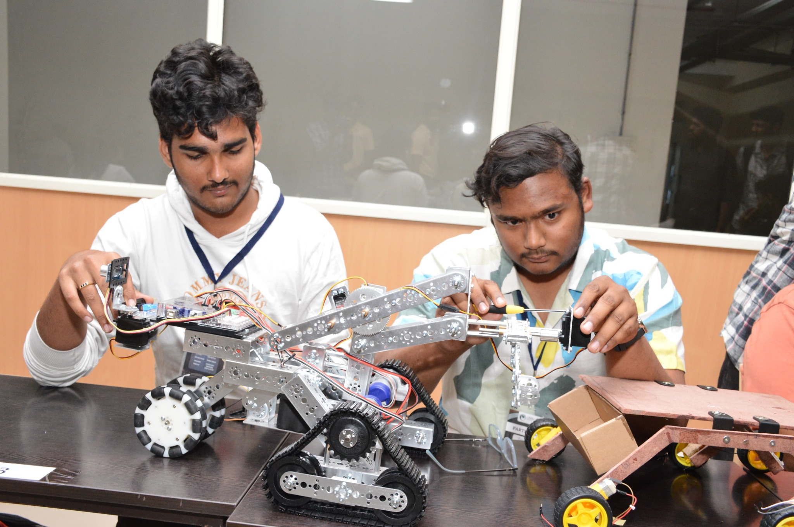
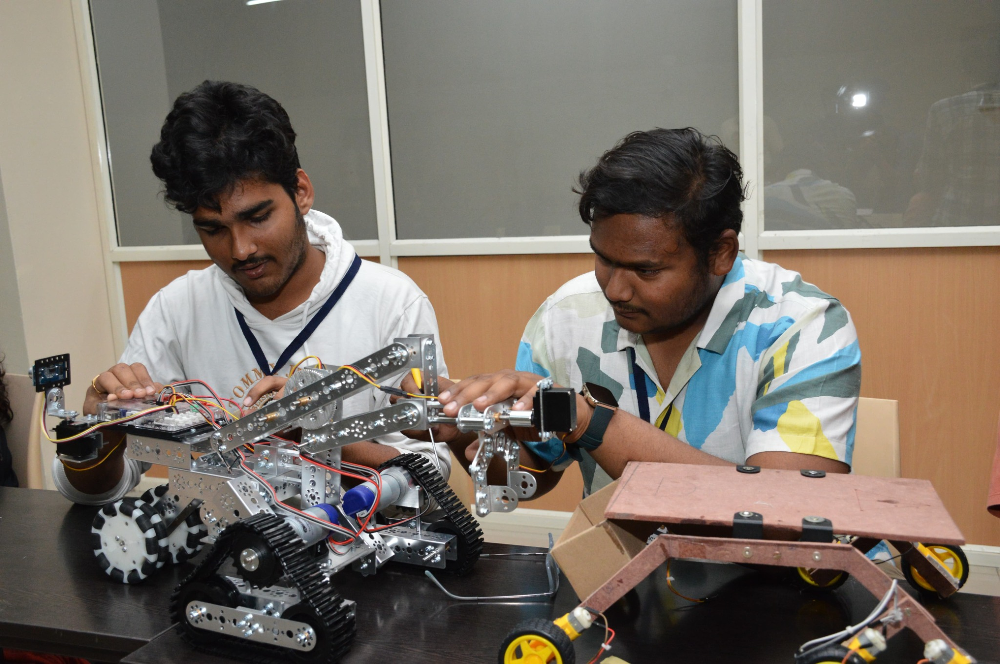

# Rover for Emergency Rescue Operations

## Description

This folder contains photos of rover prototypes developed for unmanned operation in emergency and rescue scenarios. The images show the rover body, robotic arm/gripper, electronics, wheels, and project demonstration scenes with the team.

## Folder Caption

> Rover project for unmanned emergency and rescue operations.

## Contents

- Photos/images: **8**
- Videos: **0**

## Image Files

- `emergency_rescue_rover_photo_01.jpeg`
- `emergency_rescue_rover_photo_02.jpeg`
- `emergency_rescue_rover_photo_03.jpeg`
- `emergency_rescue_rover_photo_04.jpeg`
- `emergency_rescue_rover_photo_05.jpeg`
- `emergency_rescue_rover_photo_06.jpeg`
- `emergency_rescue_rover_photo_07.jpeg`
- `emergency_rescue_rover_photo_08.jpeg`

## Preview

