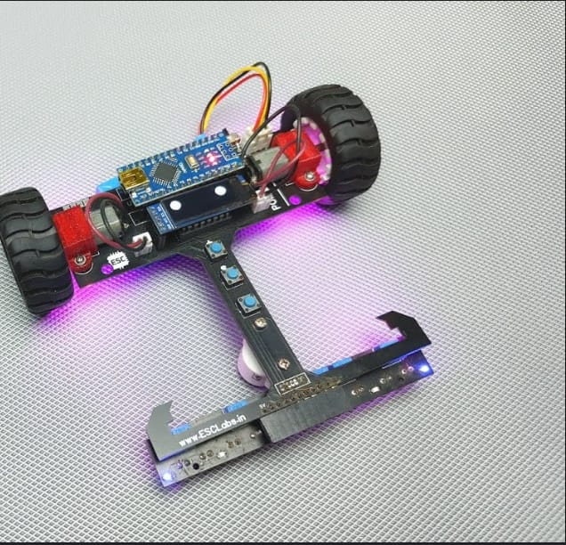
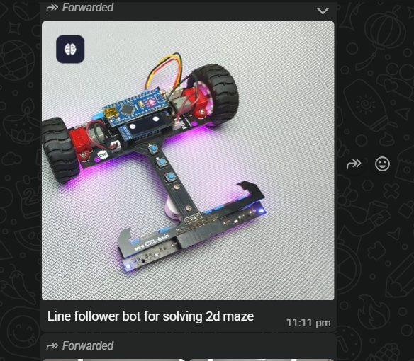

# Line Follower Bot for 2D Maze

## Description

This folder contains media for the line follower bot built to solve a 2D maze. The robot uses a wheeled base with a microcontroller and sensor array for path detection.

## Folder Caption

> Line follower bot for solving a 2D maze.

## Contents

- Photos/images: **2**
- Videos: **0**

## Image Files

- `line_follower_bot_photo_01.jpeg`
- `line_follower_bot_photo_02.png`

## Preview

