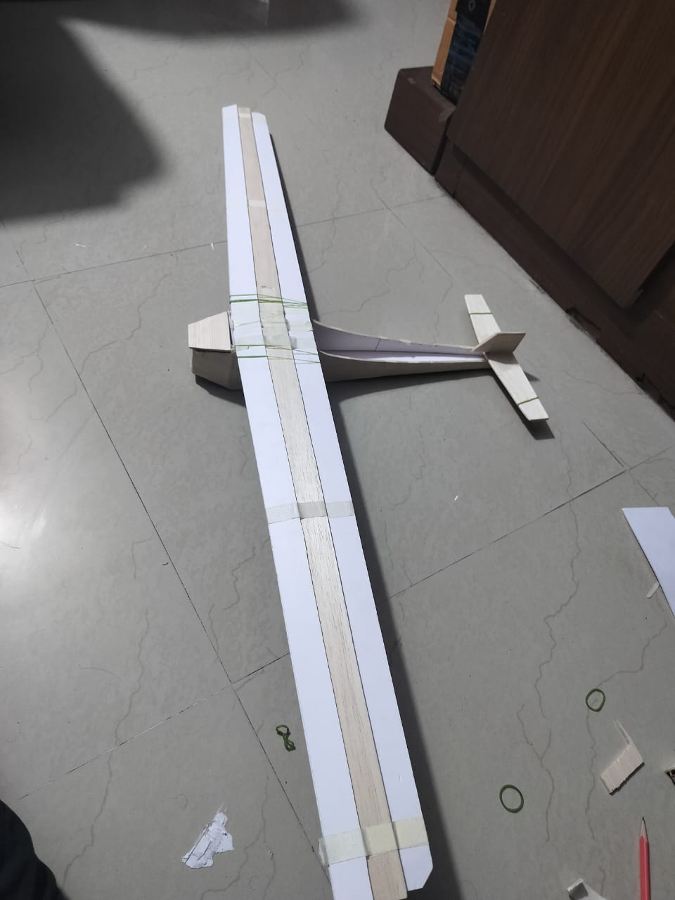
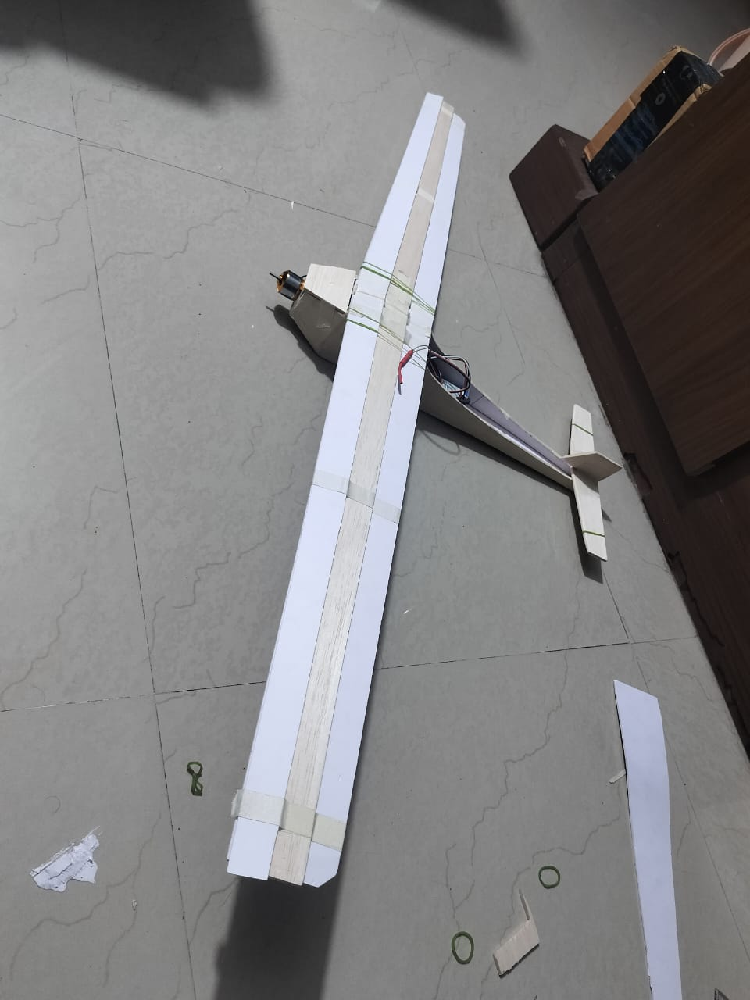

# Fixed-Wing Aircraft Model

## Description

This folder contains photos of fixed-wing aircraft prototypes and testing setups. The media shows the aircraft model from different angles, propeller and electronics placement, wing and tail structure, and remote-control testing setup.

## Folder Caption

> Fixed-wing aircraft model build and testing setup.

## Contents

- Photos/images: **14**
- Videos: **0**

## Image Files

- `fixed_wing_aircraft_photo_01.jpeg`
- `fixed_wing_aircraft_photo_02.jpeg`
- `fixed_wing_aircraft_photo_03.jpeg`
- `fixed_wing_aircraft_photo_04.jpeg`
- `fixed_wing_aircraft_photo_05.jpeg`
- `fixed_wing_aircraft_photo_06.jpeg`
- `fixed_wing_aircraft_photo_07.jpeg`
- `fixed_wing_aircraft_photo_08.jpeg`
- `fixed_wing_aircraft_photo_09.jpeg`
- `fixed_wing_aircraft_photo_10.jpeg`
- `fixed_wing_aircraft_photo_11.jpeg`
- `fixed_wing_aircraft_photo_12.jpeg`
- `fixed_wing_aircraft_photo_13.jpeg`
- `fixed_wing_aircraft_photo_14.jpeg`

## Preview

